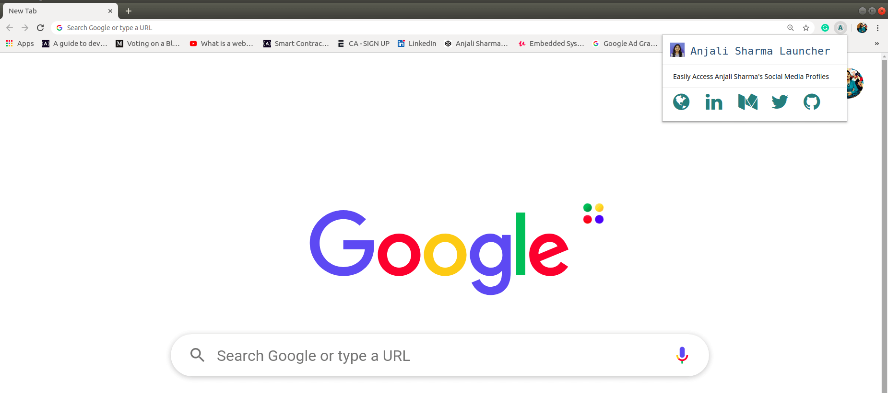

# Social Media Profile Launcher

   

A simple Chrome Extension for combining all the social media profiles at one place.

This is motivated by [Traversy Media tutorial on Google Chrome Extention](https://www.youtube.com/watch?v=wHZCYi1K664).

### Screenshot of the Chrome Extention

### Tutorial Blog Post

For my blog post tutorial on "How to build and publish a Chrome Extension in 10 minutes — Browser Extension Explained" [click here](https://medium.com/mobile-web-dev/how-to-build-and-publish-a-chrome-extension-in-10-minutes-browser-extension-explained-6caa17df46f).

### Admin

 

|  |
| :----------------------------------------------------------: |
| **[Anjali Sharma](https://www.linkedin.com/in/anjalisharmaaa/)**  |

  

